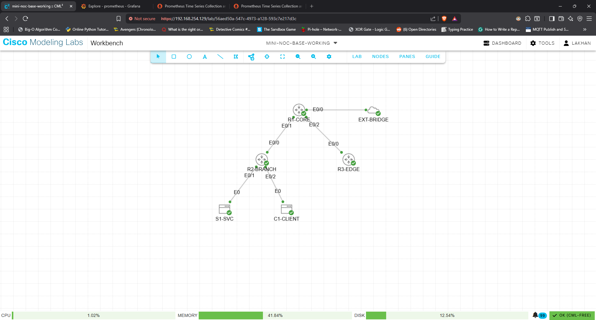

# Mini-NOC in CML Free: SNMP + Syslog + Blackbox Monitoring

This repository documents a **fully working mini-NOC lab** built in **Cisco Modeling Labs Free** with a **Windows-native monitoring stack**.

The project monitors:

- **device health and interface visibility** with **SNMP**
- **router events** with **syslog → Alloy → Loki → Grafana**
- **service reachability** with **blackbox DNS / HTTP / TCP checks**
- **control-plane failures** for **OSPF** and **BGP**



---

## Why this exact design

### Constraint 1: CML Free only allows 5 running counted nodes

The working lab uses:

- `R1-CORE` - IOL
- `R2-BRANCH` - IOL
- `R3-EDGE` - IOL
- `S1-SVC` - Alpine Linux
- `C1-CLIENT` - Alpine Linux
- `EXT-BRIDGE` - External Connector (**does not count**)

### Constraint 2: WSL / Hyper-V disabled so CML can run in VMware

Because **Virtual Machine Platform** and **Windows Hypervisor Platform** were disabled to keep CML working in VMware Workstation, the monitoring stack was built **natively on Windows**, not with Docker Desktop or WSL.

### Constraint 3: VMware Workstation NAT for the CML VM

The CML Ubuntu VM was attached to **VMnet8 NAT** and the CML lab used an **External Connector in System Bridge mode**.

That means:

- CML VM management / bridge network: `192.168.254.0/24`
- Windows VMnet8 IP: `192.168.254.1`
- `R1-CORE e0/0` DHCP address on that segment: `192.168.254.130`

---

## Monitoring Stack

Install and extract/run:

* Grafana
* Prometheus
* SNMP Exporter
* Blackbox Exporter
* Loki
* Grafana Alloy

### Important Grafana note 

Grafana on `127.0.0.1:3000` failed on this host because of a Windows bind/permission conflict, so Grafana was moved to port `8080`.

Use the provided `monitoring/grafana-custom.ini`.

---

## Firewall ports to allow

Run in Powershell adminstrative mode

```powershell
New-NetFirewallRule -DisplayName "Grafana 8080" -Direction Inbound -Protocol TCP -LocalPort 8080 -Action Allow
New-NetFirewallRule -DisplayName "Prometheus 9090" -Direction Inbound -Protocol TCP -LocalPort 9090 -Action Allow
New-NetFirewallRule -DisplayName "SNMP Exporter 9116" -Direction Inbound -Protocol TCP -LocalPort 9116 -Action Allow
New-NetFirewallRule -DisplayName "Blackbox Exporter 9115" -Direction Inbound -Protocol TCP -LocalPort 9115 -Action Allow
New-NetFirewallRule -DisplayName "Loki 3100" -Direction Inbound -Protocol TCP -LocalPort 3100 -Action Allow
New-NetFirewallRule -DisplayName "Syslog UDP 1514" -Direction Inbound -Protocol UDP -LocalPort 1514 -Action Allow
```

---

## Start the services

* **Loki**
  ```powershell
  loki-windows-amd64.exe -config.file="path\loki-config.yml>"
  ```

* **Alloy**
  ```powershell
  alloy-windows-amd64.exe" run --stability.level=experimental ""path\config.alloy"
  ```

* **SNMP Exporter**
  ```powershell
  snmp_exporter.exe --config.file="path\snmp.yml"
  ```

* **Blackbox Exporter**
  ```powershell
  blackbox_exporter.exe --config.file="path\blackbox.yml"
  ```

* **Prometheus**
  ```powershell
  prometheus.exe --config.file="path\prometheus.yml"
  ```

* **Grafana**
  ```powershell
  grafana-server.exe --config="C:\Program Files\GrafanaLabs\grafana\conf\custom.ini"
  ```

`login: admin
password: admin`

### Grafana data sources

Add these data sources:
* Prometheus → http://127.0.0.1:9090
* Loki → http://127.0.0.1:3100

---

## Failure Testing Sequence 

### Test A - HTTP failure

#### On S1-SVC:

```bash
sudo rc-service nginx stop
```

Check:

```promql
probe_success{job="blackbox_http"}
probe_success{job="blackbox_tcp"}
```

Restore:

```bash
sudo rc-service nginx start
```


### Test B - DNS failure

#### On S1-SVC:

```bash
sudo rc-service dnsmasq stop
```

Check:

```promql
probe_success{job="blackbox_dns"}
```

Restore:

```bash
sudo rc-service dnsmasq start
Test C — OSPF failure
```

#### On R2-BRANCH:

```cisco
conf t
interface Ethernet0/0
 shutdown
end
```

Check:

#### On R1-CORE:

```cisco
show ip ospf neighbor
show ip route ospf
```

#### In Loki:

```promql
{job="syslog", source="cml"} |= `OSPF`
```

Restore:

```cisco
conf t
interface Ethernet0/0
 no shutdown
end
```

### Test D - BGP failure

#### On R3-EDGE:

```cisco
conf t
interface Ethernet0/0
 shutdown
end
```

Check:

#### On R1-CORE:

```cisco
show ip bgp summary
```

#### In Loki:

```promql
{job="syslog", source="cml"} |= `BGP`
```

Restore:

```cisco
conf t
interface Ethernet0/0
 no shutdown
end
```

---

